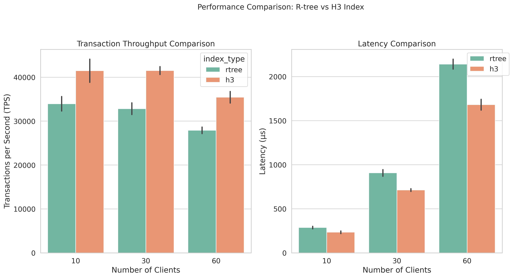

# H3 vs R-Tree in PostGIS for geofencing

## Introduction

Geofencing queries aim to answer questions such as, _"Find all polygons within the boundaries of which a point is currently located."_ These queries are widely used in applications requiring detection of objects entering or leaving specific zones, such as:
- **Fleet and Freight Management**: Monitoring the movement of vehicles and goods to ensure they remain within designated routes or areas [1].
- **Scooter Rental Services**: Identifying when scooters move beyond permissible operational zones.
- **Taxi Services**: Matching passengers to nearby taxis while ensuring that vehicles operate within service areas.

Storing geospatial data such as points and polygons in traditional relational database systems (RDBMS) presents challenges because the data is inherently multidimensional. Traditional indexing methods like B-Trees are ill-suited for geospatial queries, as they cannot efficiently process two-dimensional or multidimensional data. Instead, Spatial Database Management Systems (SDBMS) and specialized spatial indexing techniques are commonly used to address these challenges.

For geofencing queries, several tools and spatial databases stand out:
1) **PostGIS**: A widely-used geospatial extension for PostgreSQL, supporting complex spatial queries and indexing.
2) **Elasticsearch**: Known for its search capabilities, it also offers support for geospatial queries.
3) **Oracle Spatial**: A robust geospatial solution integrated into Oracle databases.
4) **Cloud-Based Solutions**: Platforms like Google Cloud BigQuery GIS and Azure Maps provide scalable, managed geospatial services.

Popular spatial indexing methods include R-Trees, KD-Trees, Quad-Trees, and grid-based indexes like Geohash, S2, and H3.

While Elasticsearch, Oracle Spatial, and cloud-based solutions are intriguing areas of research, this article focuses on using PostGIS to explore different approaches for efficient geofencing queries. Specifically, it compares the tree-based R-Tree index with the grid-based H3 index to evaluate their performance. Intuitively, the method with H3 with preprocessesing of polygons into smaller hexagonal cells mapped to polygons, is hypothesized to perform better in certain scenarios.

The dataset for this comparison includes polygons representing points of interest (sightseeing locations) in Wroclaw, Berlin, and London, sourced from OpenStreetMap. This benchmark evaluates two methods for geofencing queries in PostGIS:
1) Using [ST_Contains](https://postgis.net/docs/ST_Contains.html) function with [R-Tree](https://en.wikipedia.org/wiki/R-tree) index in [PostGIS](https://postgis.net/)
2) Preprocessing polygons into [H3](https://h3geo.org/) hexagons at small resolution with B-Tree index on the H3 hash.

## Perspectives on the Point-in-Polygon (PIP) Problem

At the core of geofencing queries is the Point-in-Polygon (PIP) problem, which determines whether a given point lies within a specified polygon. In PostGIS, this is implemented using the Ray Casting algorithm. Depending on the type of spatial data, the calculations can involve:

- **GEOMETRY**: Cartesian (planar) calculations based on Euclidean geometry.
- **GEOGRAPHY**: Spherical calculations, accounting for Earth's curvature.

While effective, ray casting can become computationally expensive when dealing with a large number of points or complex polygons. This makes it less suitable for applications requiring high performance or real-time responses.

An alternative approach involves using geospatial grids to simplify point-in-polygon checks. Grids divide the world into predefined, uniform cells (such as hexagons in the case of H3). By mapping polygons and points to these cells, geofencing queries can be reduced to simple lookups or range queries, significantly improving performance.

This article evaluates whether grid-based methods like H3 can offer substantial advantages over traditional tree-based indexing methods like R-Trees in PostGIS, particularly for large-scale geofencing scenarios.

## Tradeoffs

## Benchmarking pre-requisites

## Results

As shown in figure, the benchmarking revealed a significant performance difference between two approaches for geofencing when tested with a varying number of concurrent clients (10, 30, and 60). The H3 method consistently demonstrated superior transaction throughput across all concurrency levels, resulting in 20- 25\% better performance, achieving 42,000 TPS versus 34,000 TPS in 10 clients, with the advantage maintained at higher concurrency levels. Similarly, in terms of latency, H3 outperformed R-Tree when the number of clients was increasing.

It is crucial to note that these results specifically pertain to geofencing query patterns, which are particularly suited to H3's hierarchical hexagonal grid structure. Range query performance analysis, while crucial for other aspects of our applications, such as nearby point discovery, was not evaluated due to time constraints and remains an area for future investigation.

## Disclaimer

## References

Fabrice Reclus and Kristen Drouard. Geofencing for fleet & freight management. In 2009 9th In-
ternational Conference on Intelligent Transport Systems Telecommunications,(ITST), pages 353–356.
IEEE, 2009.

